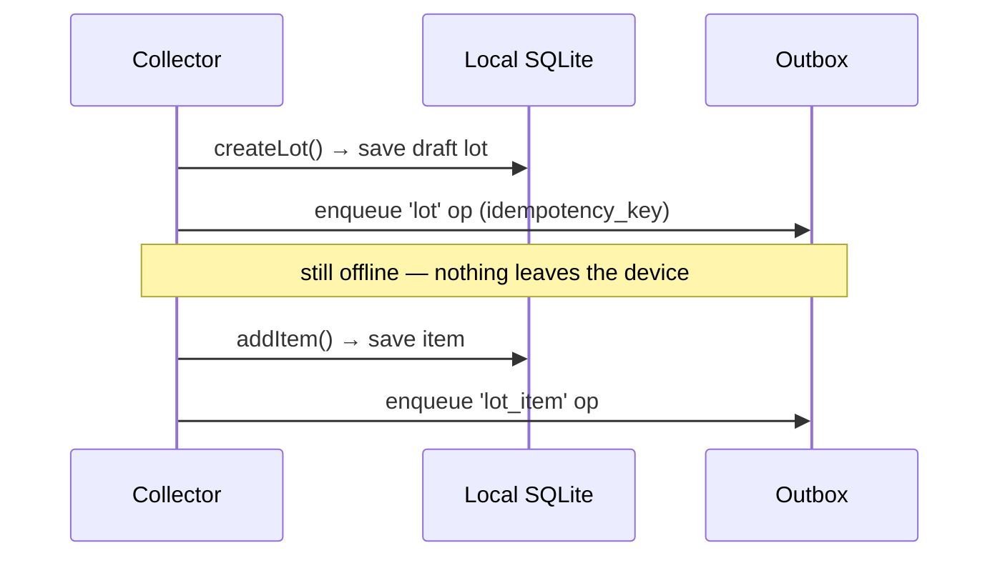
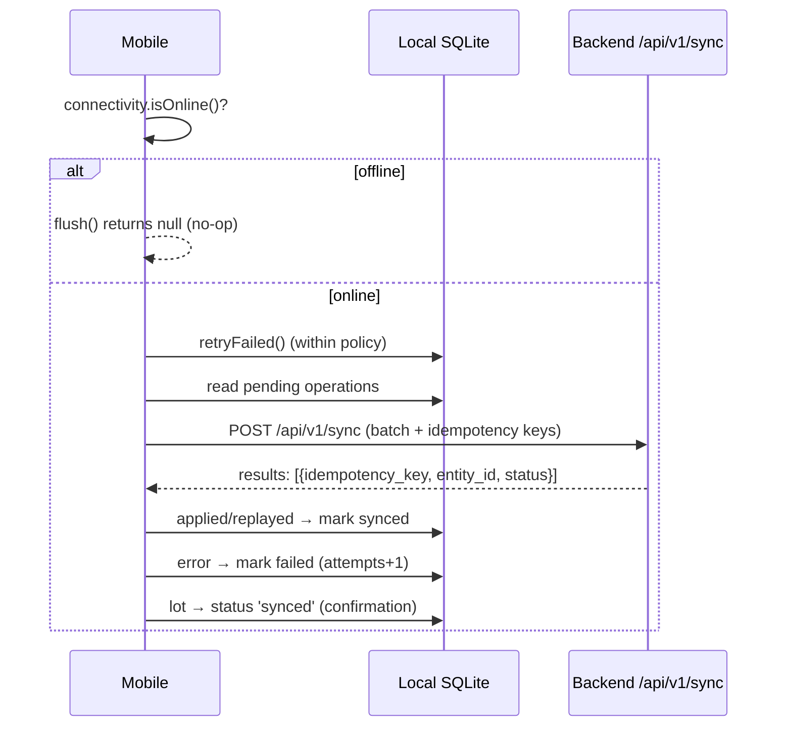
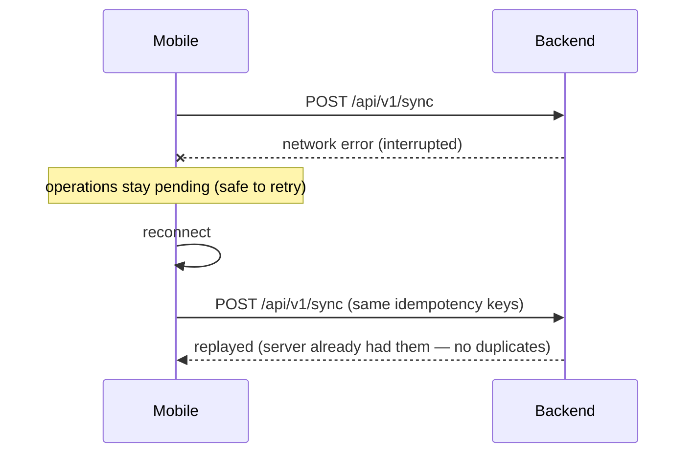
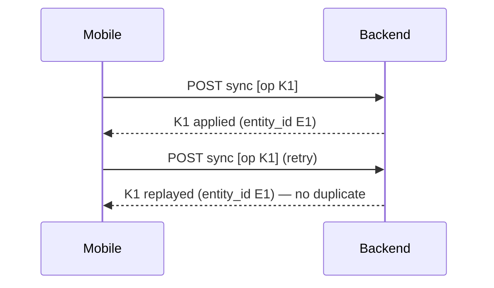

# Offline Sync — Offline-First Architecture

> Phase 6 deliverable. Describes the offline-first mobile data layer and the
> sync contract with the authoritative backend. The backend is always the source
> of truth; the mobile app works on local SQLite and pushes idempotent batches
> when connectivity returns.

---

## 1. Principle

Collectors operate in low-connectivity areas. The mobile app must let them
capture material, build draft lots, and read safety/price content **without a
connection**, then sync when back online. The backend remains authoritative
(FR-043); sync uses idempotency keys so a repeated batch never creates duplicate
records (FR-044).

> **Honesty rule.** We do **not** pretend the whole backend is offline-capable.
> Anything that depends on server state (AI, matching, quotes, verification,
> live price aggregation) is explicitly **ONLINE REQUIRED**. See §2.

---

## 2. Offline vs online

| Capability | Mode | Why |
| ---------- | ---- | --- |
| Create lot | **OFFLINE SUPPORTED** | local draft + outbox |
| Add item to lot | **OFFLINE SUPPORTED** | local draft + outbox |
| Attach image metadata | **OFFLINE SUPPORTED** | Cloudinary refs staged locally; binary upload is online |
| Record weight | **OFFLINE SUPPORTED** | only when the parent transaction already exists |
| Record payment | **OFFLINE SUPPORTED** | only when the parent transaction already exists |
| View cached materials | **OFFLINE SUPPORTED** | read-only local cache |
| View cached prices | **OFFLINE SUPPORTED** | read-only local cache |
| View safety content | **OFFLINE SUPPORTED** | read-only local cache |
| AI classification | **ONLINE REQUIRED** | server AI provider |
| Confirm recycler quote | **ONLINE REQUIRED** | server state |
| Generate matches | **ONLINE REQUIRED** | server recycler data + PostGIS |
| Nearby recycler search | **ONLINE REQUIRED** | PostGIS spatial query |
| Live price estimate | **ONLINE REQUIRED** | server aggregation |
| Recycler verification | **ONLINE REQUIRED** | admin-only server state |

This mapping is codified in `mobile/src/offline/capabilities.ts`.

---

## 3. Architecture

```
mobile/src/
├── types/                # snake_case wire contract + local entities
├── db/
│   ├── schema.ts         # local SQLite schema (offline working DB)
│   └── store.ts          # LocalStore interface + InMemoryStore (test impl)
├── sync/
│   ├── queue.ts          # offline outbox (pending_operations)
│   ├── retry.ts          # retry / backoff policy
│   └── service.ts        # SyncService orchestrator (capture + flush + confirm)
├── api/client.ts         # SyncApi — POST /api/v1/sync (snake_case)
├── lib/
│   ├── uuid.ts           # client UUID
│   ├── idempotency.ts    # KC-<ENTITY>-<YYMMDD>-<NNNNNN>
│   └── connectivity.ts   # online/offline detection
├── cache/cache.ts        # read-only local cache (materials/prices/safety)
└── offline/capabilities.ts
```

**Layering**: the sync layer depends on the `LocalStore` and `SyncApi`
interfaces, not on `expo-sqlite` or `fetch`, so it is fully unit-testable under
Node. `InMemoryStore` is the reference/test implementation; an `expo-sqlite`
adapter implements `LocalStore` on-device.

---

## 4. Local SQLite schema

```sql
collector_profile      (user_id, collector_type, display_name, preferred_locale)
materials              (id, code, name, kind, category_type, sort_order, updated_at)
lots                   (id, title, notes, latitude, longitude, pickup_address, status, synced_at)
lot_items              (id, lot_id, collector_category_id, material_category_id, ...)
lot_images             (id, lot_id, lot_item_id, cloudinary_public_id, cloudinary_url, ...)
weights                (id, transaction_id, weight_type, weight_kg, source)
cached_prices          (key, value, updated_at)
safety_content         (key, value, updated_at)
pending_operations     (idempotency_key, entity_type, entity_id, payload, status, attempts, last_error, created_at)
```

`pending_operations` is the **outbox**. `lots`/`lot_items`/`lot_images`/`weights`
are local working data. `materials`/`cached_prices`/`safety_content` are
read-only caches. `collector_profile` caches identity.

---

## 5. Sync flow

The full round-trip:

```
Local SQLite (draft) -> pending operation -> API -> server ack -> local marked synced
```

### 5.1 Offline capture



### 5.2 Sync (reconnect)



### 5.3 Interrupted sync & retry



A **network failure** leaves operations pending (the client cannot know whether
the server applied them). A **server-returned `error`** marks that operation
failed for retry (or manual review after the attempt cap).

---

## 6. Idempotency

- Every mutating operation carries an `idempotency_key`
  (`KC-<ENTITY>-<YYMMDD>-<NNNNNN>`), generated client-side (TR-016).
- The key is stable across retries of the same operation, so re-sending a batch
  is a server-side no-op (the backend records the key in `sync_operations` and
  returns `replayed` with the original `entity_id`).
- Supported `entity_type`s: `lot`, `lot_item`, `transaction`, `weight`, `payment`.



## 7. Retry strategy

`ExponentialBackoff` caps attempts and grows the delay between retries:

- `maxAttempts` (default 3).
- `shouldRetry(op)`: `status === 'failed' && attempts < maxAttempts`.
- `delayMs(attempt)`: `baseDelayMs * factor^attempt` (device sleeps this before retrying).

Operations that exhaust retries stay `failed` for manual review.

## 8. Conflict handling

- The backend is authoritative and **last-write-wins**; there is no automatic
  merge of concurrent edits.
- **Create** operations are idempotent (replay, not error).
- A `replayed` result is success; a server `error` is recorded on the operation
  and retried per policy.

## 9. Local cache

Read-only caches (materials, price estimates, safety content) are JSON-encoded
in `cached_prices`/`safety_content`/`materials` and read back when offline. They
are refreshed opportunistically while online and never treated as authoritative.

## 10. Connectivity detection

The `Connectivity` interface (`lib/connectivity.ts`) abstracts online/offline:
`ReachabilityConnectivity` pings `/health` with a timeout on-device;
`StaticConnectivity` lets tests simulate airplane mode deterministically.

## 11. Backend contract

`POST /api/v1/sync` (see [api-design.md](api-design.md) §5.20):

```json
{
  "operations": [
    {"idempotency_key": "KC-LOT-…", "entity_type": "lot", "id": "<uuid>", "payload": {"title": "…"}},
    {"idempotency_key": "KC-ITEM-…", "entity_type": "lot_item", "id": "<uuid>", "payload": {"lot_id": "<uuid>", "material_category_id": "…"}}
  ]
}
```

Response: `{ "results": [ {"idempotency_key": "…", "entity_id": "<uuid>", "status": "applied|replayed|error", "error": null} ] }`.

Operations are applied in order, each committed independently. Ownership is
enforced server-side on parent references (`lot_item.lot_id`, `weight.transaction_id`, …).

---

## 12. Test scenarios (validated)

`mobile/src/sync/service.test.ts` (plus store/queue/retry tests) covers:

| Scenario | Assertion |
| -------- | --------- |
| airplane mode | create lot offline → `flush()` no-ops, no network call, lot stays `draft` |
| create lot | draft lot saved + outbox operation enqueued |
| reconnect + sync | pending op applied, lot → `synced`, outbox empty |
| repeated sync | synced ops are not re-sent |
| duplicate prevention | `replayed` result treated as success, not failure |
| interrupted sync | network error leaves ops pending; retry applies them |
| retry | server `error` marks failed; retried on next sync up to `maxAttempts` |

Run: `cd mobile && npm test` (20 tests). Typecheck: `npm run typecheck`.

---

## 13. Implementation status

- **Implemented (this phase)**: snake_case wire contract, local SQLite schema,
  `LocalStore` + `InMemoryStore`, outbox queue, retry policy, `SyncService`
  orchestrator, connectivity abstraction, cache, capabilities map, and the full
  offline test suite.
- **Device-only (NEEDS VALIDATION)**: the `expo-sqlite` adapter for `LocalStore`
  and `ReachabilityConnectivity`/`NetInfo` — these run on-device and are not
  exercised under Node. The pure layer is fully validated.
