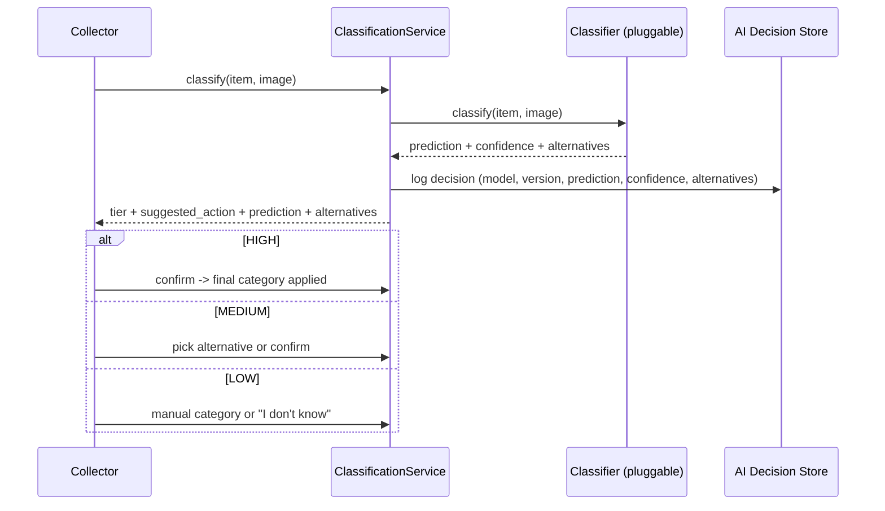
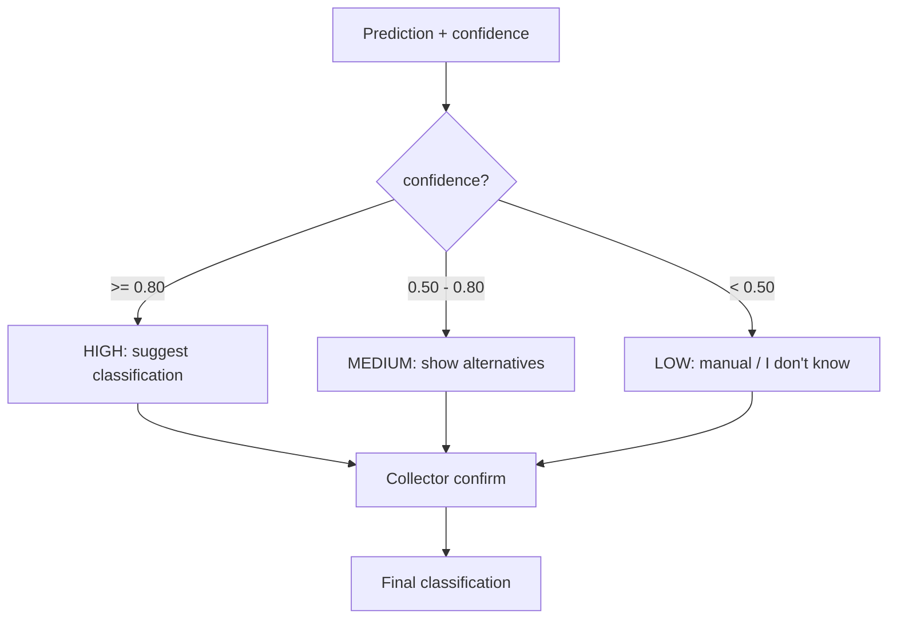
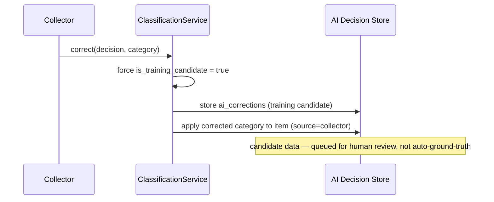

# AI Architecture

> Phase deliverable. The classification layer is **assistive, never
> authoritative**. The backend decides nothing on AI's word alone; a human
> confirms or corrects, and corrections become **candidate training data**, never
> ground truth.

---

## 1. Principle

AI suggests; a human decides. The system stores the full decision trail so the
suggestion, the confidence, the alternatives, the human action, and the final
category are auditable.

```
Image -> AI classifier -> Prediction -> Confidence -> Human confirmation -> Final classification
```



---

## 2. Replaceable classifier

`app/ai/provider.py` defines `BaseProvider` with a single `classify(item, image_id)`
method returning a `ClassificationResult`. Providers are registered by name and
selected via the `AI_PROVIDER` environment variable — swapping models does not
touch business logic.

```python
class BaseProvider:
    provider: str
    model: str | None
    model_version: str | None
    async def classify(self, item: dict, image_id: str | None) -> ClassificationResult: ...
```

- `none` (default) — `NullProvider`, forces manual classification.
- `reference` — `ReferenceProvider`, a deterministic classifier used to exercise
  and test the full flow without a trained model.

Real providers (OpenAI / Anthropic / self-hosted) are added the same way. The
result carries `provider`, `model`, and `model_version` so every decision records
which model produced it.

## 3. Confidence behavior

`app/ai/provider.py:confidence_tier()` classifies confidence against two
thresholds (`AI_CONFIDENCE_THRESHOLD=0.80`, `AI_REVIEW_THRESHOLD=0.50`):

| Tier | Confidence | Collector action | `suggested_action` |
| ---- | ---------- | ---------------- | ------------------ |
| HIGH | ≥ 0.80 | suggest the classification | `suggest` |
| MEDIUM | 0.50 – 0.80 | show alternatives | `alternatives` |
| LOW | < 0.50 | manual select or "I don't know" | `manual` |



## 4. Decision logging

Every classification is recorded in `ai_decisions` with the full audit trail:

| Required field | Storage |
| -------------- | ------- |
| AI model | `ai_decisions.model_name` (denormalized) + `ai_models` registry |
| Model version | `ai_decisions.model_version` |
| Prediction | `predicted_category_id` / `predicted_subcategory_id` |
| Confidence | `confidence` |
| Alternative predictions | `alternatives` (jsonb list of `{category_id, subcategory_id, confidence, label}`) |
| Image reference | `material_image_id` |
| Human correction | `ai_corrections` (linked to the decision) |
| Final category | `lot_items.material_category_id` after confirm/correct |
| Verification status | `ai_decisions.status` (`suggested` → `confirmed`/`corrected`/`rejected`) |
| Timestamp | `created_at` |

Migration `backend/migrations/0016_ai_enhancements.sql` (additive) adds
`provider`, `model_name`, `model_version`, and `alternatives`.

## 5. What AI must not claim

From an ordinary photograph, the classifier **MUST NOT** claim (FR-AI-10):

- exact chemical composition,
- exact gold / silver / copper (precious-metal) content,
- certified hazardousness,
- lab-grade material grade.

The provider contract enforces this by construction: predictions are only a
category/subcategory suggestion with a confidence, never a composition or grade
assertion.

## 6. Valuation — INDICATIVE VALUE

`app/services/valuation.py` combines material classification, weight, location,
price observations, recycler quotes, and transport cost into an **INDICATIVE
VALUE** — a transparent estimate, never a guarantee.

```
indicative_value = weight_kg × median(price_per_kg) − transport_cost
```

The output is always labelled `"INDICATIVE VALUE"`, includes a value **range**
(min/max from the data), the basis (weight, price, transport, sample count), and
a disclaimer. With no price data the estimate is `null` — the system never
invents a number.

## 7. Corrections → candidate training data

Collector corrections are stored in `ai_corrections` with
`is_training_candidate = true`. They are **candidate** training data that require
review before use — never applied as ground truth.



## 8. Implementation status

- **Implemented & unit-tested**: provider abstraction + `ReferenceProvider`,
  confidence tiers, `ClassificationService` (classify/confirm/correct with
  ownership + conflict checks), decision logging, valuation, training-candidate
  enforcement.
- **Persistence**: `InMemoryAIDecisionRepository` (tested) and
  `PostgresAIDecisionRepository` (production; requires migration `0016` + a live
  database).
- **Not yet wired**: the HTTP endpoints still live in the legacy
  `app/routers/ai.py`; they will migrate onto this service layer. Real AI
  providers remain external (no credentials).
