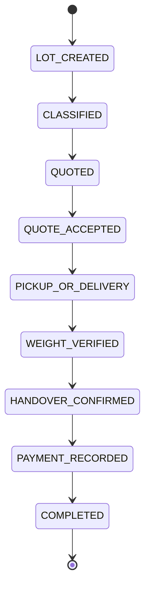

# Transaction Lifecycle & Traceability

> Phase deliverable. The transaction state machine, its actions, audit trail,
> earnings ledger, and dispute initiation. The backend is authoritative; every
> critical state transition writes an audit event.

---

## 1. State machine



Legal transitions are enforced by `TRANSITIONS` in `app/models/transaction.py`.
Illegal jumps raise `ConflictError` (409).

## 2. Actions

| Action | Service method | State change |
| ------ | -------------- | ------------ |
| Transaction creation | `create(...)` | → `LOT_CREATED` |
| Quote acceptance | `accept_quote(...)` | `QUOTED` → `QUOTE_ACCEPTED` |
| Declared / pickup / final weight | `record_weight(...)` | none (final sets `final_weight_kg`) |
| Generic transition | `transition(...)` | any legal step |
| Handover | `record_handover(...)` | → `HANDOVER_CONFIRMED` |
| Payment | `record_payment(...)` | → `PAYMENT_RECORDED` |
| Payment confirmation | `confirm_payment(...)` | `recorded` → `confirmed` |
| Dispute initiation | `initiate_dispute(...)` | creates `disputes` row |
| Earnings ledger | `earnings(...)` | read-only (completed transactions) |

## 3. Payment methods

`cash`, `upi`, `bank_transfer` (enforced by `PaymentMethod`). **Cash remains
supported** and is the default in tests; digital payment is optional (FR-PAY-02).
An unknown method raises `ValueError`.

## 4. Idempotency

Critical mutations are idempotent via an `idempotency_key`:

| Action | Idempotent |
| ------ | ---------- |
| Transaction creation | ✅ (`transactions.idempotency_key`) |
| Handover | ✅ (`handover_records.idempotency_key`, migration `0018`) |
| Payment | ✅ (`payments.idempotency_key`) |

A repeated key returns the existing record and does not create a duplicate.

## 5. Audit events

`app/repositories/transaction.py` writes an `audit_events` row for every critical
mutation:

- `transaction.created`
- `transaction.status_changed` (one per transition, with before/after status)
- `handover.recorded`
- `payment.recorded`
- `payment.confirmed`
- `dispute.raised`

## 6. Earnings ledger

`earnings(collector_id)` returns the completed transactions and their net
earnings:

```
net_earnings = final_weight_kg × agreed_price_per_kg − transport_cost
```

plus a running total. (Indicative valuation — see
[ai-architecture.md](ai-architecture.md) — labels computed values
`INDICATIVE VALUE`.)

## 7. Traceability

End-to-end traceability is preserved through `transaction_events` (status
changes), `weights` (declared/pickup/final), `handover_records`, `payments`, and
`audit_events`.

## 8. Implementation status

- **Implemented & unit-tested**: `TransactionService` (create, transition,
  accept-quote, weights, handover, payment, confirm, dispute, earnings) and the
  idempotency + audit-event behavior, validated with the in-memory repository.
- **Persistence**: `InMemoryTransactionRepository` (tested) and
  `PostgresTransactionRepository` (requires migrations `0018` + a live database).
- **Not yet wired**: HTTP endpoints live in the legacy `app/routers/transactions.py`
  and will migrate onto this service layer.

## 9. Validation

`pytest tests/unit/test_transaction.py` walks the complete end-to-end lifecycle,
asserts 8 transitions produce 8 `status_changed` audit events, verifies the
earnings ledger, and exercises idempotency for creation, handover, and payment.
