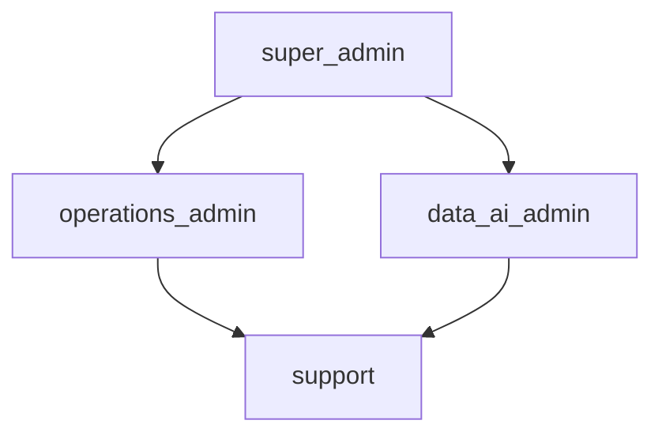

# Security & Administrative Layer

> Phase deliverable. Authentication, authorization, isolation, audit, rate
> limiting, secure media handling, and the administrative role model. Collectors
> work through the app; admins govern recycler verification, disputes, AI/price
> review, user support, and audit.

---

## 1. Threat model

| Threat | Mitigation |
| ------ | ---------- |
| Unauthenticated access | Supabase JWT verification (RS256, `iss`/`aud`) |
| Privilege escalation | Role-based access control with a role hierarchy |
| Cross-tenant data access | Organization isolation (`org_scope`) + ownership checks |
| Collector A reading Collector B's data | Ownership scoping on lots/transactions |
| Recycler A acting as Recycler B | Recycler org scoping + `recycler_id` checks |
| Unauthorized admin action | Role-gated admin operations |
| Sensitive data in error responses | Sanitized validation errors (no echoed input) |
| Replay / duplicate mutations | Idempotency keys on critical writes |
| Abuse / brute force | Fixed-window rate limiting |
| Secret leakage | Environment-variable secrets, git-ignored `.env` |
| Media exfiltration | Cloudinary signed upload; metadata-only in Postgres |
| Tampering / disputes | Append-only audit trail |

## 2. Authentication

Identity provider is **Supabase Auth**. Clients send `Authorization: Bearer <jwt>`;
the backend verifies RS256 against the project JWKS and checks `iss`/`aud`. The
`sub` maps to `users.id` (auto-provisioned). `Principal` (`app/core/security.py`)
carries `sub`, `roles`, and `organization_id`.

## 3. Authorization

### Roles

Nine roles (`app/models/role.py`):

`collector`, `kabadiwala`, `aggregator`, `recycler`, `dismantler`,
`support`, `operations_admin`, `data_ai_admin`, `super_admin`.

### Hierarchy

A role implies the roles below it (`ROLE_IMPLIES`): `super_admin` can act as any
admin; `operations_admin`/`data_ai_admin` can act as `support`.

### Checks

- `require_role(*codes)` — 403 unless the principal holds (or implies) a role.
- `org_scope(principal)` — super_admin sees all; an org-scoped user sees their
  org; an unscoped non-admin sees nothing.
- **Collector data isolation** — every collector-facing query is scoped by
  ownership (`collector_id`); a foreign resource returns 404/403.
- **Recycler access controls** — a recycler can only read/act on their own
  `recycler_organization_id`.
- **Admin permissions** — see §7.

## 4. Data privacy

- **Data minimization** (`FR-060`): auto-provisioned users store only
  `id` + `email`/`phone`. No unnecessary personal data is collected.
- **No Aadhaar** (`FR-061`).
- Sensitive recycler fields (`gstin`, `registration_number`,
  `authorization_number`) are admin/recycler-only.
- Error responses never echo submitted values (`app/core/errors.py` strips
  `input`/`ctx` from validation errors).

## 5. Media security

Images never enter PostgreSQL. Flow: **collector → Cloudinary (signed upload) →
public ID / URL → metadata in Postgres**. Signed upload parameters are issued by
the backend and rejected (503) when Cloudinary is unconfigured.

## 6. API security

- **Rate limiting**: `app/core/rate_limit.py` fixed-window limiter (in-memory;
  Redis for multi-instance), exempting health endpoints.
- **Input validation**: Pydantic on every request body/query.
- **Error handling without leakage**: uniform `{"error": {code, message, details}}`
  envelope with generic messages; no stack traces, SQL, or secrets.

## 7. Administrative layer

`AdminService` (`app/services/admin.py`) gates each capability by role:

| Capability | Roles |
| ---------- | ----- |
| Recycler verification | `super_admin`, `operations_admin` |
| Authorization expiry review | `super_admin`, `operations_admin` |
| Dispute review | `super_admin`, `operations_admin`, `support` |
| AI decision review | `super_admin`, `data_ai_admin` |
| Price observation review | `super_admin`, `data_ai_admin`, `operations_admin` |
| User support (suspend/reactivate) | `super_admin`, `operations_admin`, `support` |
| Audit log read | `super_admin` |

## 8. Database security

- RLS is off (ADR-0013); the backend is the sole data-access layer (service-role
  connection). Organization isolation is enforced in the application layer.
- Secrets are environment-variable only (`app/core/config.py`, pydantic-settings).
- `0019_roles.sql` aligns the role seed with the 9-role model.

## 9. Audit

Every critical mutation writes an `audit_events` row (actor, action, entity,
before/after JSON): transaction creation, status transitions, handover, payment,
dispute, AI confirm/correct, recycler verification, price review. See
[transaction-lifecycle.md](transaction-lifecycle.md).

## 10. Backup

Supabase PostgreSQL is hosted and backed up by Supabase. Cloudinary stores media
(metadata-only references live in Postgres). Backups should be tested via
restore drills; media remains in Cloudinary with its own retention policy.

## 11. Incident response

1. **Detect** — alert on audit anomalies (unexpected 403/429 spikes, mass reads).
2. **Contain** — suspend the affected user/organization via `support_user`.
3. **Investigate** — query the audit trail by entity/user.
4. **Remediate** — correct AI/price decisions, resolve disputes, rotate leaked
   secrets.
5. **Recover** — restore from Supabase backup if needed; verify data integrity.

## 12. Validation

`pytest tests/unit/test_security.py` + `test_admin.py` cover the role hierarchy,
`require_role`/`org_scope`, rate limiting, validation-error sanitization, and
role-gated admin operations (authorized/forbidden paths).
